# Rutina - 피부 일기를 기록하는 어플
**개인의 피부와 스킨 케어 루틴 개선을 위한, Rutina**
- 과목 : 2022년도 4학년 1학기 캡스톤디자인2 
- 프로젝트 기간 : 2022년 3월 ~ 2022년 6월 9일
- 팀 구성 : Front-End 3, Back-End 2
- 팀명 : 먼데이즈(Mondays)

## 목차
1. [배경](#1-배경)
2. [개발 환경 [Skills]](#2-개발-환경-skills)
3. [아키텍쳐](#3-아키텍쳐)
4. [ERD](#4-ERD)
5. [화장품 데이터 준비](#5-화장품-데이터-준비)
6. [주요 기능](#6-주요-기능)

## 1. 배경
- 코로나 19로 인한 스킨케어 관심도 증가 
  - 마스크를 착용하는 기간이 길어지면서 화장품 업계에서 메이크업 제품보다 스킨케어 제품에 관심이 늘어나는 것을 알 수 있다. 
  - 장시간 마스크 착용으로 발생하는 피부 고민 해소를 위한 맞춤형 스킨케어 제품의 추천과 자신만의 스킨케어 루틴 설계가 필요하다고 생각하였다.
- 참고한 어플 : 스킨로그, 화해

## 2. 개발 환경 [Skills]
- Language : Java, Python, PHP
- DB : MySQL 8.0
- Cloud : AWS EC2
- Tools : Figma, Notion
- IDE : Android Studio, PyCharm

## 3. 아키텍쳐 
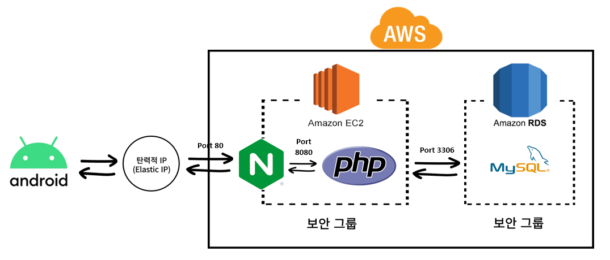 

## 4. ERD 
 

## 5. 화장품 데이터 준비
### 5-1. Open API 조사  
'시용하는 화장품 등록' 기능에 필요한 화장품 데이터를 준비하기 위해 공공데이터 포털의 [“식품의약품안전처_기능성화장품 보고품목정보”](https://www.data.go.kr/data/15095680/openapi.do) Open API를 활용한다.

### 5-2. 데이터 전처리 과정 (issue https://github.com/MondaysRutina/backend/issues/3)  
1. 제품이 보고서에 등록된 날짜를 검사하여 2017년 이후에 등록된 데이터만 추출하기
2. 직접 작성한 [“화장품 제외 리스트”](api_cosmetic_data/cosmetic_data_files/화장품%20제외%20리스트.xlsx)를 활용하여 스킨케어 제품 외의 화장품 제외하기
3. 제품명에서 카테고리 특징 단어를 찾아내어 카테고리별로 화장품 분류하기
4. 전처리된 화장품 데이터를 엑셀 파일로 출력하기 ➡ [final_cosmetic_data.xlsx](api_cosmetic_data/cosmetic_data_files/final_cosmetic_data.xlsx)

## 6. 주요 기능
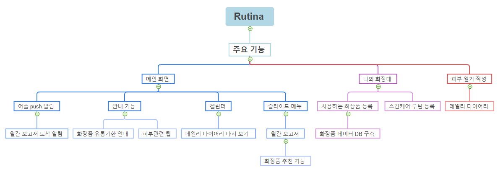 

### 6-1. 로고 및 인트로 화면
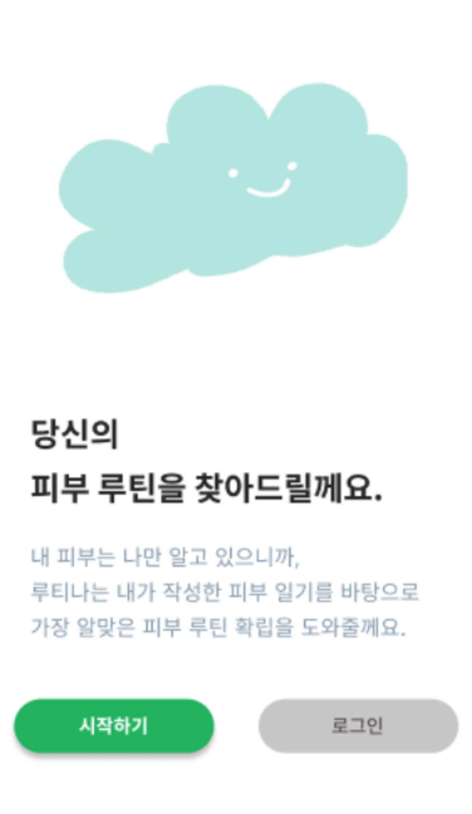</img> 

### 6-2. 로그인 & 회원가입
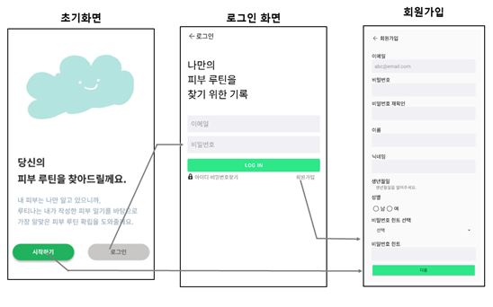</img> 

- 피부 타입과 피부 고민을 입력 받는다. 

  |                피부타입                 |                피부고민                 |
  |:-------------------------------------:|:--------------------------------------:|
  | 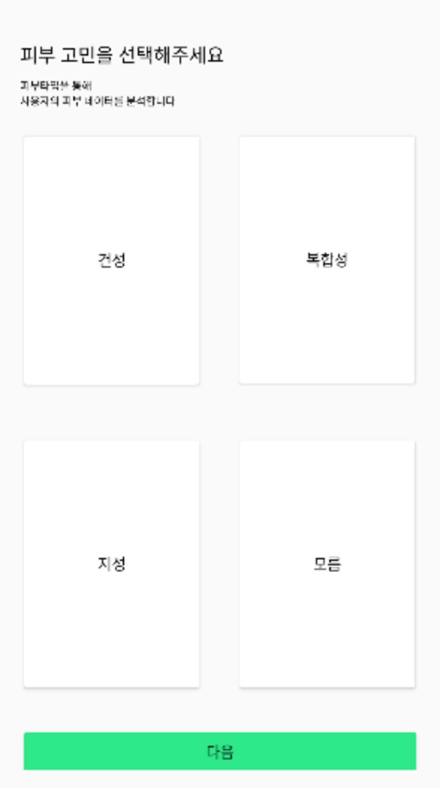</img> | 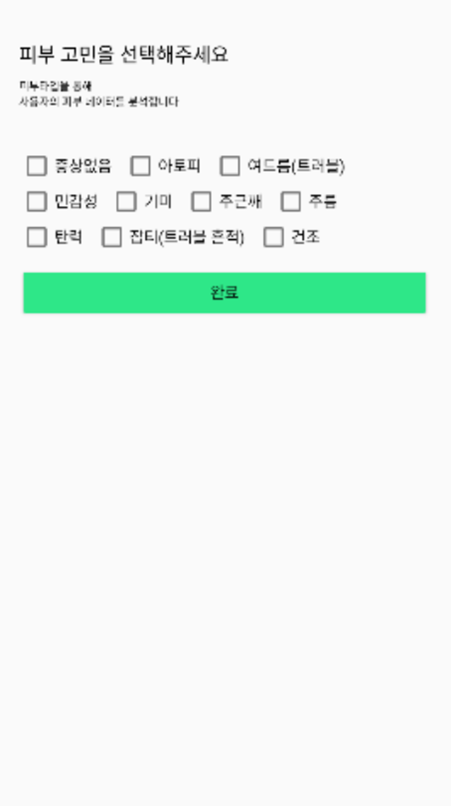</img> |

### 6-3. 메인 화면
1. 루틴 기록 캘린더 
    - 캘린더의 날짜를 누르면 피부 일기를 다시 볼 수 있다. 
    - 로그인한 사용자의 닉네임이 보인다. 
    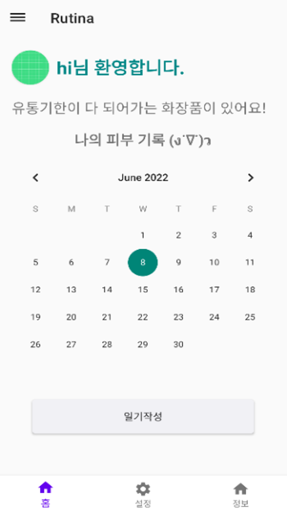</img> 

2. 월간 보고서 
   - 슬라이드 메뉴를 통해 월간 보고서를 확인할 수 있다. 
   - 한 달간의 피부 상태를 비교할 수 있도록 월의 처음과 마지막 얼굴 사진을 제공한다. 
   - 한 달간의 스트레스 지수, 평균 수면 시간, 음주 회수, 많이 선택된 피부 증상을 알려준다. 
   - 피부 증상 태그에 따라 효과있는 화장품을 추천해준다. 
   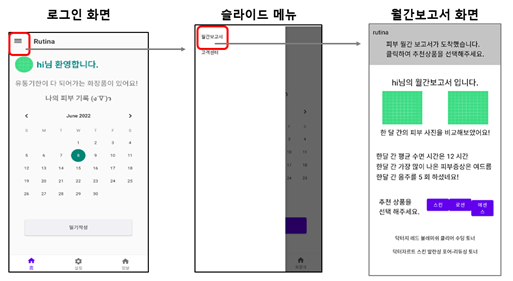</img> 

### 6-4. 피부 일기 작성
- 메인 화면의 일기 작성 버튼을 누르면 데일리 다이어리를 작성할 수 있다. 
- 얼굴 사진 촬영, 사용한 화장품 루틴 선택, 피부 상태(수면시간, 스트레스, 음주, 생리, 화장여부, 피부 증상)기록, 메모 등을 작성할 수 있다. 

  | 얼굴 사진 촬영 및 사용한 화장품 루틴 선택                       |              피부 상태 기록 및 메모 작성               |
  |:-------------------------------------------:|:-------------------------------------------------:|
  | 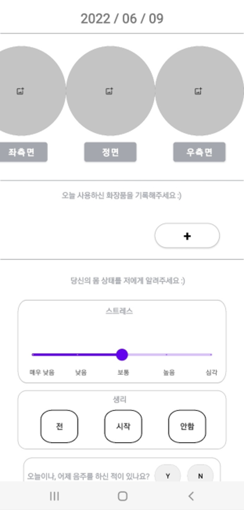</img> | 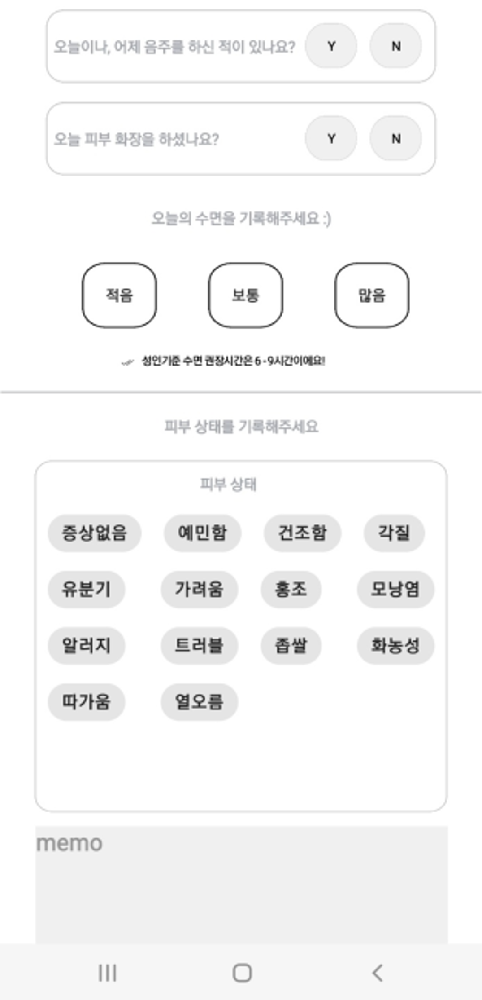</img> |

### 6-5. 나의 화장대
1. 사용하는 화장품을 등록 : 화장품 데이터를 불러와 사용자가 추가/수정/삭제할 수 있는 화장품 목록을 보여준다. 화장품 개봉일을 등록할 수 있다.
2. 스킨 케어 루틴 등록 : 스킨 케어 루틴 등록하여 데일리 다이어리 작성 시 사용한 루틴을 불러올 수 있다.

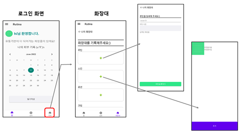</img> 
