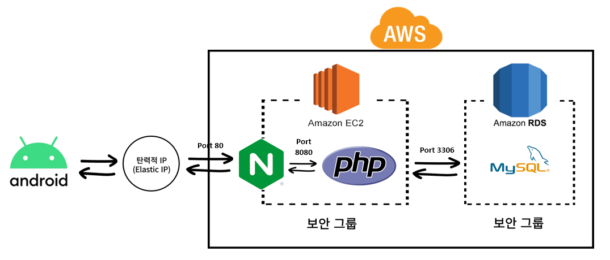
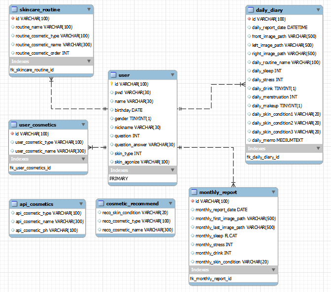
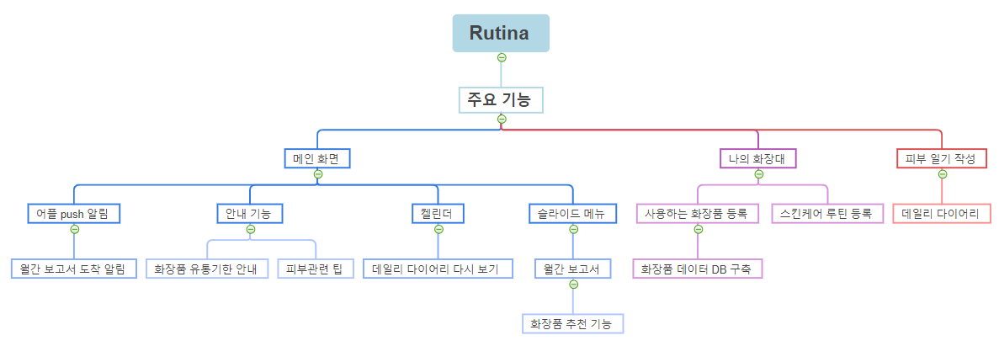

# Rutina - 피부 일기를 기록하는 어플
- 과목 : 2022년도 4학년 1학기 캡스톤디자인2 
- 프로젝트 기간 : 2022년 1월 ~ 2022년 6월 9일
- 팀 구성 : Front-End 3, Back-End 2
- 팀명 : 먼데이즈(Mondays)

## 목차
1. [배경](#1-배경)
2. [개발 환경](#2-개발-환경)
3. [아키텍쳐](#3-아키텍쳐)
4. [ERD](#4-ERD)
5. [화장품 데이터 준비](#5-화장품-데이터-준비)
6. [주요 기능](#6-주요-기능)

## 1. 배경
- 코로나 19로 인한 스킨케어 관심도 증가<br/>
    마스크를 착용하는 기간이 길어지면서 화장품 업계에서 메이크업 제품보다 스킨케어 제품에 관심이 늘어나는 것을 알 수 있다.<br/>
    장시간 마스크 착용으로 발생하는 피부 고민 해소를 위한 맞춤형 스킨케어 제품의 추천과 자신만의 스킨케어 루틴 설계가 필요하다고 생각하였다.

- 참고한 어플 : 스킨로그, 화해

## 2. 개발 환경
```
* Language : Java, Python, PHP
* DB : MySQL 8.0
* Cloud : AWS
* Tools : Figma
* IDE : Android Studio, PyCharm
```

## 3. 아키텍쳐 
</br>

## 4. ERD 
</br>

## 5. 화장품 데이터 준비
### 5-1. Open API 조사 <br/>
'시용하는 화장품 등록' 기능에 필요한 화장품 데이터를 준비하기 위해 공공데이터 포털의 [“식품의약품안전처_기능성화장품 보고품목정보”](https://www.data.go.kr/data/15095680/openapi.do) Open API를 활용한다.

### 5-2. 데이터 전처리 과정 (issue https://github.com/MondaysRutina/backend/issues/3) <br/>
1. 제품이 보고서에 등록된 날짜를 검사하여 2017년 이후에 등록된 데이터만 추출하기
2. 직접 작성한 [“화장품 제외 리스트”](api_cosmetic_data/cosmetic_data_files/화장품-제외-리스트.xlsx)를 활용하여 스킨케어 제품 외의 화장품 제외하기
3. 제품명에서 카테고리 특징 단어를 찾아내어 카테고리별로 화장품 분류하기
4. 전처리된 화장품 데이터를 엑셀 파일로 출력하기 ➡ [final_cosmetic_data.xlsx](api_cosmetic_data/cosmetic_data_files/final_cosmetic_data.xlsx)

## 6. 주요 기능
</br>
